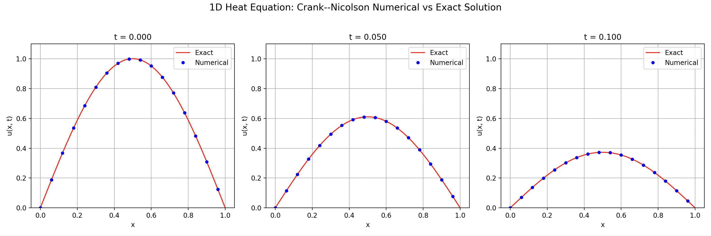
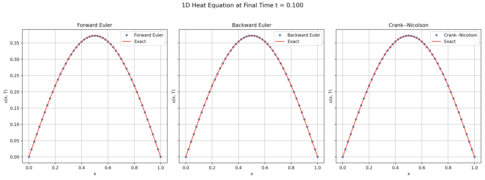

# A modular C++ framework for solving the 1D heat equation
This project provides a flexible C++ framework for numerically solving the 1D heat equation
```math
    \frac{\partial u}{\partial t} = \alpha \frac{\partial^2 u}{\partial x^2}
```
where $x \in [a, b]$, $t \geq 0$, and $\alpha$ is the diffusion coefficient. The following parameters are fully configurable:
- Spatial domain and grid resolution. 
- Dirichlet boundary conditions. 
- Initial condition.
- Diffusion coefficient $\alpha$.

The framework includes three finite difference methods: 
- Forward Euler
- Backward Euler
- Crank–Nicolson

The Backward Euler and Crank–Nicolson methods are solved using a tridiagonal solver implementing the Thomas algorithm. 

## Example
As a demonstration, we solve the heat equation
```math
    \frac{\partial u}{\partial t} = \alpha \frac{\partial^2 u}{\partial x^2}
```
on the spatial domain $[0, 1]$ with homogeneous Dirichlet boundary conditions $u(0, t) = u(1, t) = 0$, and initial condition given by $u(x, 0) = \sin(\pi x)$. 

In this case, the heat equation has an exact solution given by the function
```math
    u(x, t) = e^{-\alpha \pi^2 t} \, \sin(\pi x)
```
which we will use to validate the numerical solution. For the purpose of this demonstration, we will use the Crank–Nicolson method. 

### Example of C++ usage
We first explain how to use the C++ framework in this setting. 

```cpp
#include "Grid1D.h"
#include "HeatEquation1D.h"
#include "BoundaryCondition.h"
#include "InitialCondition.h"
#include "ForwardEuler1D.h"
#include "BackwardEuler1D.h"
#include "CrankNicolson1D.h"
#include <iostream>
#include <cmath>

int main()
{
    // Parameters 
    int Nx = 50;            //< Number of spatial points
    double a = 0.0;         //< Left boundary
    double b = 1.0;         //< Right boundary
    double alpha = 1.0;     //< Diffusion coefficient
    double dt = 0.0001;     //< Time step size
    double T = 0.1;         //< Final time

    // Grid
    Grid1D grid(Nx, a, b);

    // Heat equation with diffusion alpha. 
    HeatEquation1D pde(alpha);

    // Homogeneous Dirichlet boundary conditions: u(0,t)=0, u(1,t)=0
    BoundaryCondition bc(
        [](double /*t*/) { return 0.0; },
        [](double /*t*/) { return 0.0; }
    );

    // Initial condition
    InitialCondition ic([](double x) {
        return std::sin(M_PI * x);
    });

    // Choose solver. We will use the Crank–Nicolson scheme. 
    CrankNicolson1D solverCN(grid, pde, bc, ic, dt, T);

    // Run the simulation and save results
    solverCN.initialize();
    solverCN.runSimulationWithSnapshots("HeatCN", 50);

    return 0;
}
```

### Output of simulation
During the simulation above, the solver periodically writes snapshots of the solution to text files with the extension `.dat`. Each file contains two columns: $x$ and $u(x, t)$, where
- $x$ is the spatial coordinate on the grid $[0, 1]$. 
- $u(x, t)$ is the solution at that point of the grid and the time of the snapshot. 

For example, a snippet of `results/HeatCN_step500` might look like: 
```
0 0
0.02 0.0383397
0.04 0.0765281
...
0.96 0.0765281
0.98 0.0383397
1 0
```
The first and last rows correspond to the boundary conditions, and the interior rows are the values of the solution at those time steps.

The naming convention is:

- `HeatFE_stepN.dat`: Forward Euler snapshot at step `N`  
- `HeatBE_stepN.dat`: Backward Euler snapshot at step `N`  
- `HeatCN_stepN.dat`: Crank–Nicolson snapshot at step `N`

If we instead use the command `runSimulation()`, the script writes:

- `HeatFE.dat`, `HeatBE.dat`, `HeatCN.dat`

which contain only the last snapshot at the final time. 

These plain-text files are lightweight and easy to parse in Python.  
The included Python plotting utility (`examples/plot_results.py`) directly reads these `.dat` files and produces plots. 

### Visualization in Python
We now explain how to visualize the simulation done above in Python. In the folder `examples/example-outputs/full-simulation-CN`, we have saved the output of the simulation in C++ above. The simulation can be visualized with the following Python script:

```python
from plot_results import plot_simulation, plot_simulation_final_time, Parameters

p = Parameters()
plot_simulation(solver="cn", parameters=p)
```

This produces the following output:


We see the evolution of the solution at different snapshot times for the Crank–Nicolson scheme. The solutions are shown at the initial, middle, and final time. 

It is also possible to plot the solutions at the final time obtained by using all three finite difference schemes. 

```python
plot_simulation_final_time(parameters=p)
```



### The Courant–Friedrichs–Lewy number and stability
We end by providing a few remarks on the Courant–Friedrichs–Lewy number
```math
    r = \frac{\alpha \, \Delta t}{\Delta x^2}
```
since it governs the stability and accuracy of explicit time-stepping schemes for the heat equation. 

- Forward Euler: requires $r \leq 0.5$ for stability.  
- Backward Euler: unconditionally stable.  
- Crank–Nicolson: unconditionally stable, second-order accurate, but may show oscillations if $r$ is too large.  

---

## Project structure
This repository is organized as follows:

```text
1d-heat-equation-solver/
├── examples/                       # Example outputs in .dat format and python script for plotting.
│   ├── example-outputs/
│   ├── plot_results.py
│   ├── cn-simulation.png
│   └–– simulation-finaltime.png
├── include/                        # Header files
│   ├── BackwardEuler1D.h
│   ├── BoundaryCondition.h
│   ├── CrankNicolson1D.h
│   ├── ForwardEuler1D.h
│   ├── Grid1D.h
│   ├── HeatEquation1D.h
│   ├── HeatSolver1D.h
│   ├── InitialCondition.h
│   └── TridiagonalSolver.h
├── src/                            # Source files
│   ├── BackwardEuler1D.cpp
│   ├── BoundaryCondition.cpp
│   ├── CrankNicolson1D.cpp
│   ├── ForwardEuler1D.cpp
│   ├── Grid1D.cpp
│   ├── HeatEquation1D.cpp
│   ├── HeatSolver1D.cpp
│   ├── InitialCondition.cpp
│   └── TridiagonalSolver.cpp
├── CMakeLists.txt
├── LICENSE
├── main.cpp
└── README.md
```

## Build
Build with CMake as follows:

```bash
# Create build directory
mkdir build && cd build

# Configure
cmake ..

# Build
make

# Run solver
./HeatEquationSolver 
```

## License
This project is licensed under the MIT License. 
You are free to use, modify, and distribute this code for educational, research, or commercial purposes, provided that proper credit is given.


